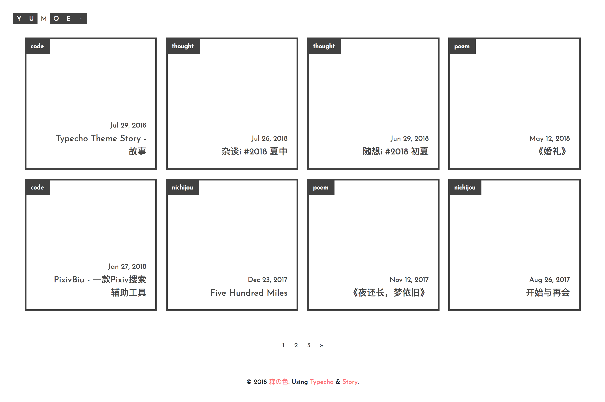

## Story

每个人都有属于自已的故事，我们编织着、叙述着，只为了那个必定动人的结局。

爱上自已的故事，爱上别人的故事，交织着的，是美好，是快乐，是幸福。

> 最近想开始记录一下自已的所见所得，感觉缺了一个可以让人安心记录的地方。
>  
> 就这样，Story 诞生了。

Demo: [Yumoe](https://yumoe.com/).

Version@[Halo](https://github.com/ruibaby/halo): [story-halo](https://github.com/ruibaby/story-halo) by [ruibaby](https://github.com/ruibaby), thanks.

Version@[纸小墨](https://www.chole.io/): [ink-theme-story](https://github.com/akkuman/ink-theme-story) by [akkuman](https://github.com/akkuman), thanks.

Version@[VeriPress](https://github.com/veripress/veripress): [Story-for-VeriPress](https://github.com/txperl/Story-for-VeriPress).

### 预览图

[主页](https://i.loli.net/2018/10/09/5bbcbea01d230.png)



### 主题的一些食用说明

#### config.php

Story 包含一个全局配置文件。

``` 
// on 为开启
// off&其他 为关闭

// 导航树
$GLOBALS['isTorTree'] = 'off'; // 默认显示文章导航树

// 样式
$GLOBALS['isAutoNav'] = 'off'; // 自动设置导航栏中 margin 及 width 值（推荐开启）
$GLOBALS['isIconNav'] = 'off'; // 将导航栏中的 1,2,3 替换成 Emoji 图标
$GLOBALS['isRSS'] = 'off'; // 在菜单栏中加入 RSS 按钮

$GLOBALS['style_BG'] = ''; // 背景图设置。填入图片 URL 地址，留空为关闭
```

#### 菜单

标题旁边有一个 · 字符，点击后便可显示菜单。**1**, **2**, **3** 分别代表 **独立页面菜单**、**导航树**(仅在文章界面有用，仅解析 h3, h4 标签)以及**搜索框**。

若您觉得 1, 2, 3 太抽象，可以将 `config.php` 中 `$GLOBALS['isIconNav']` 设置为 `on` 即可替换成相应 Emoji 图标。

#### 网站标题修改

本主题要修改标题必须自行修改代码... 位于 `header.php` 的 `class .header-logo(56行处)` ，用 `<span class="b"></span>` 及 `<span class="w"></span>` 把自已的站点标题拼接出来就行了，其他可以不做修改。

#### 修改网站标题后菜单定位

您可以将 `config.php` 中 `$GLOBALS['isAutoNav']` 设置为 `on` 即可自动调整，无需进行以下操作。

若您网站标题字数与原来(5个英文字母)不同，那要自行修改菜单的 `margin` 值。位于 `assert/css/main.css` 的 `#menu-page(777行处)` 及 `#search-box(799行处)` ，每个字符格子宽度为 28px ，可自行计算（别忘了算上菜单格，有4个）。

#### 背景图

若要设置背景图，请修改位于 `config.php` 的 `$GLOBALS['style_BG']` 变量值。改为图片链接即可，留空为关闭。

#### 导航树

若要所有文章默认显示导航树，请修改位于 `config.php` 的 `$GLOBALS['isTorTree']` 变量值。

若要手动控制，请于 `文章编辑页面-自定义字段` ，添加 `tor` 字符，并设置为 `on` 或者 `off` 。如下图所示：


注意，导航树仅解析 h3, h4 标签，并且当页面宽度小于 1024px ，导航树将不再显示。

#### 文章封面图

可为各文章单独设置封面图（显示在方格中）。

请于 `文章编辑页面-自定义字段` ，添加 `cover` 字符，并设置为**相应图片的链接**。如下图所示：


#### 友链模板

请参考 [PR: 增加友链模板 #30](https://github.com/txperl/Story-for-Typecho/pull/30)。

#### 其他

其他没有特别说明的基本不需要修改，当然你也可以按照个人兴趣随意修改。

若有什么不清楚可以给我发邮件或是到[主题发布页](https://yumoe.com/archives/story.html)&GitHub询问。

### 写在最后

#### 感谢

* [Art Chen](https://about.me/hermitage)-[Artifact.me](https://artifact.me/)-[Element](https://github.com/artchen/hexo-theme-element) 主题首页样式参考（获得许可）以及部分代码引用
* [Jimmy](https://jimmycai.com/) Yellow 主题评论框参考以及部分代码引用（获得许可）

#### 许可

本程序源代码可任意修改并任意使用，但禁止商业化用途。一旦使用，任何不可知事件都与原作者无关，原作者不承担任何后果。

如果您喜欢，希望可以在页面某处保留原作者(Trii Hsia)版权信息。

感谢。
